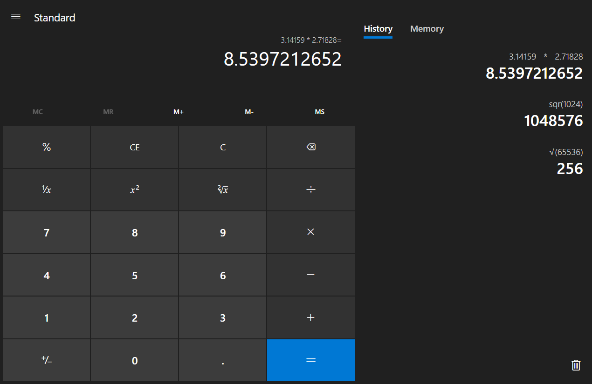
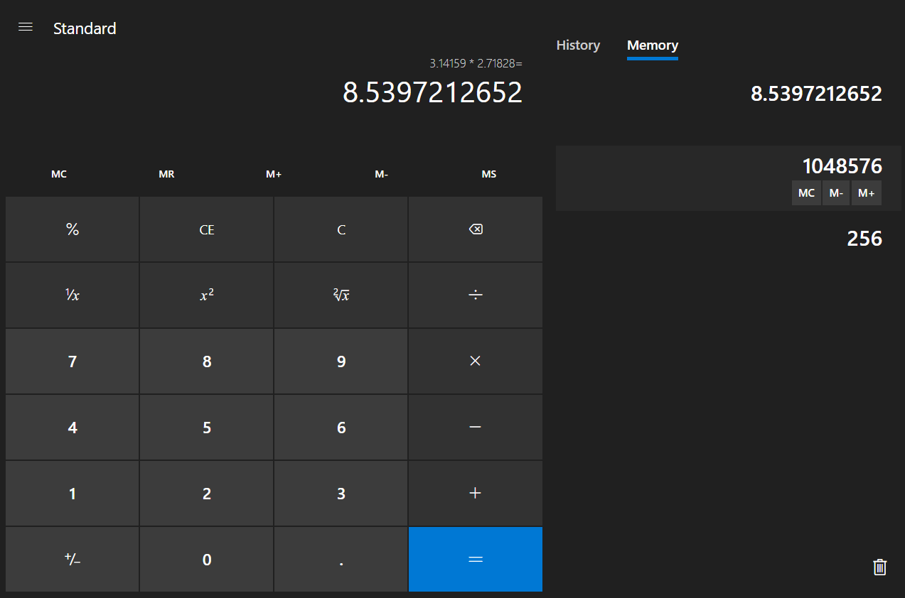

# MCalculator

It is a port of the Microsoft Calculator App engine to the web, emulating the same UI on the front-end. 

Try it [here](https://mcalc.pages.dev/)



# Engine

The Engine is written entirely in cpp with modern and legacy C++ code mixed with Windows-specific tools. Modifying the bits here and there and making it work with CMakeTools was a challenge initially. However, after adding my thin cpp View layer to interact with the core engine, I compiled it to WebAssembly using [Emscripten](https://emscripten.org/) to make it interact with the browser environment.

# UI

UI layer was written in plain HTML, CSS, and vanilla Javascript to make it run fast and have a small footprint. Keyboard and Button clicks are captured and mapped to the engine commands. The engine does all the calculations and most of the error and state handling and sends the results back to the UI.

# Features working as of now
* All basic operations.
* [Infinite precision](https://en.wikipedia.org/wiki/Arbitrary-precision_arithmetic).
* History panel.
* Memory panel, with `MC`, `M+`, and `M-` functions. Hover or tap the list items to reveal these buttons.



# Build

You'll need _Emscripten_ to build. 

1. Download and install [Emscripten](https://emscripten.org/docs/getting_started/downloads.html#sdk-download-and-install).

2. cd to `engine/` and run:

```bash
%/path/to/emscripten%/emcmake cmake .
%/path/to/emscripten%/emmake make
%/path/to/emscripten%/emcc -02 libEngine.a CalcManager/libCalcManager.a CalcModel/libCalcModel.a  -o engine.js
```

If you are having trouble with these commands, you can also try to build using [ninja](https://ninja-build.org/)

```bash
%/path/to/emscripten%/emcmake cmake . -G Ninja
%/path/to/emscripten%/emmake ninja
%/path/to/emscripten%/emcc -02 libEngine.a CalcManager/libCalcManager.a CalcModel/libCalcModel.a  -o engine.js
```

The first two lines generate _Cmake_ files and _library.a_ files respectively in their respective folders.

See [CMakeLists.txt](./engine/CMakeLists.txt).

The third one generates the `engine.js` and `engine.wasm` files which should be copied over to the `js` folder.

If you want to build without commenting out `#include <intsafe.h>` in [engine/CalcManager/pch.h](./engine/CalcManager/pch.h), you have to follow these steps before building.